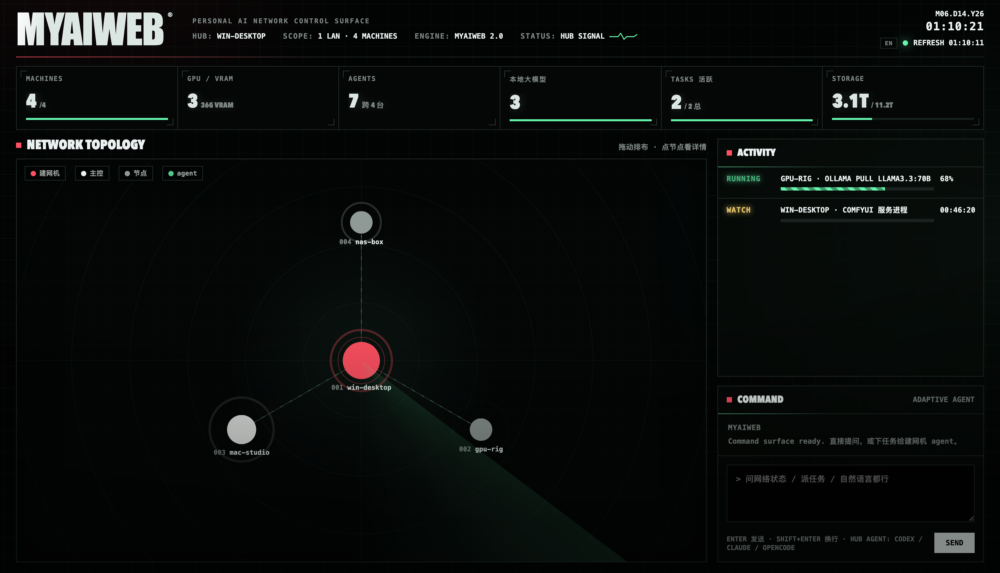

# myainet

[中文](README.md) · **English**

**A personal automation AI network — let your AI agent command all your machines, not just the one it runs on.**

> 把你自己的多台机器组成一张个人自动化 AI 网络，让 AI agent 跨机器统一调度。

myainet is an **agent skill**. It turns your own machines into a single **personal automation AI
network**: each machine plays its part, and your agent (Claude Code / codex / opencode) dispatches
work across all of them — run inference on the box with a GPU, keep a service alive on the
always-on box, control the whole fleet even when you're away. They're all *your* machines:
no cloud, no sharing, no telemetry.

## Requirements

The scripts are pure Python with **zero pip dependencies** — standard library only (even the
registry is a self-contained raw-socket script). No Docker, no `pip install`. Because of that,
each machine that joins only needs two things:

- **A Python interpreter (3.7+).** The scripts use syntax introduced in 3.7, so that's the floor;
  anything newer works. On Windows it's usually `python` / `py` (not necessarily `python3`) — and
  if it's missing, the skill installs it for you.
- **An agent that can load skills** (Claude Code / codex / opencode / Claude Desktop, etc.). See install below.

## Install

This is a standard **Agent Skill** — a folder containing `SKILL.md` ([Agent Skills open standard](https://agentskills.io)).
**This repo's root *is* that folder** (`SKILL.md` and `scripts/` live here). Install differs per host:

- **Claude Code / codex / opencode, etc. (folder-based)** — put this repo into the agent's skills directory,
  e.g. `~/.claude/skills/myainet/` (Claude Code) or `~/.codex/skills/myainet/` (codex).
- **Claude Desktop / claude.ai (file upload)** — upload the packaged [`myainet.skill`](myainet.skill)
  (a zip of the same folder); one file, done.

## Setup

One machine at a time, **starting with the hub**:

1. **Hub** — set this up first; it *is* the network. Pick an always-on machine, load the skill,
   choose "hub". It stands up the registry (where every machine is listed) + remote access
   (SSH + Tailscale) + the dashboard, in one shot.
2. **Control** — the machine you carry / use most (laptop, desktop). Load the skill, choose
   "control"; it connects to the hub and can now read and command the whole fleet (Tailscale auto-installed).
3. **Nodes** — the rest of your compute / service machines. Load the skill, choose "node"; it scans
   itself and registers into the network. **Nodes don't need Tailscale** — they're reached through
   the hub.

> Roles are **per-machine**: once a machine has confirmed its role, **any other agent that later
> installs the skill on it works immediately** — no need to set it up again.
>
> Add one **secondary hub** per extra LAN (a slimmed-down hub).

## Usage (after setup)

In any task, just invoke the skill — your agent instantly gets the **live state of the whole fleet**
(who's online, who has a GPU, what's installed, what's running) and can dispatch work in plain language:

- "Run this training on the machine with a GPU" → runs as-is on the target, returns immediately
- "Set up ComfyUI on that box" → delegated to that machine's own local agent
- "Run this long job in the background and keep it alive" → detached + watched by the patrol
- "Show me the fleet" → reads the registry, or open the dashboard (browser / phone, topology +
  compute + tasks, EN/中 toggle)

**On a phone / tablet with no agent?** Open the hub's dashboard in a browser — there's a command box.
Talk to the hub's agent directly and delegate tasks to it; nothing to install on the phone. (This is
the "borrow the hub's agent" path, for when your end has no agent of its own.)

> **Recommended: let one agent command the whole fleet directly, rather than chaining multiple agents.**
> The agent you're talking to (on control / hub) uses every machine's GPU / disk / bandwidth as if it
> were local — one brain, one direct chain of command: deterministic, fast, visible. The skill **also
> supports multi-agent collaboration** (delegating to each machine's local agent — good for "set up an
> environment" / fuzzy goals), but chaining agents is slower and more opaque — **prefer a single agent
> dispatching directly.**

## License

PolyForm Noncommercial 1.0.0 — free for any noncommercial use (personal / research / study);
**commercial use is not permitted**. See [LICENSE](LICENSE).
